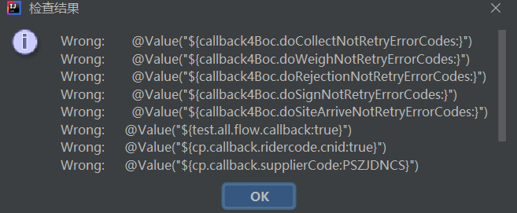

## title 1

a


### subtitle

Markdown is a lightweight and easy-to-use syntax for styling your writing. It includes conventions for

```markdown
Syntax highlighted code block

# Header 1
## Header 2
### Header 3

- Bulleted
- List

1. Numbered
2. List

**Bold** and _Italic_ and `Code` text

[Link](url) and 
```

For more details see [GitHub Flavored Markdown](https://guides.github.com/features/mastering-markdown/).

### 图片test

测试图片



测试土拍你

### 个人项目

工作学习中，自己独立开发的一些项目和玩具

#### 一、钉钉消息分组发送服务

[钉钉消息分组发送服务](https://github.com/yaogeass123/dispatch-sender-service)

背景：

目的：

设计：
搭建微服务，目的是实现消息的自动分流与及时展示。

背景：对于线上服务出现了故障或错误应该有实时的反馈途径，目前反馈到钉钉群中，存在以下问题。

1. 钉钉消息机器人目前一分钟只能发送20条消息，超过该限制时，会被限流十分钟。使用机器人发送消息时，若一时间推给机器人发送消息的请求过多（每分钟超过二十条），会导致超过数量的消息发不出去，并且机器人被限流。
2. 当前消息发送时需要指定一个机器人，而一个群最多可以指定6个机器人。
3. 目前所有的异常都集中在部门兜底群中进行警报，网络抖动时产生的大量异常堆栈有时会淹没需要关注的错误异常。
4. 很多想要通过钉钉发送的消息通过error日志的形式报警到了兜底中。 兜底群中所有报警都集中在了部门兜底群中，比较杂乱。

解决问题：

做一个钉钉群消息发送平台，对外提供接口，外部通过调用接口发送钉钉消息。

通过使用该系统进行发送，解决的问题：
1、消息聚合：某一时间段内，重复消息只发送一次。
2、机器人一定不被限流：避免一分钟内某个机器人发送消息过多导致被限流的场景
3、消息的自动分流：通过配置，可以将同一应用不同消息发送到不同的群中，也可以将不同应用的消息发送到同一群中。消息选择群的规则可配置。
4、消息的正常情况下的及时触达：保证消息一定会在对应的群中进行报警。
5、重要消息在大流量请求下的优先发送：某一群同时有大量消息待发送时，对消息进行优先级排序，优先发送重要消息。
6、消息发送失败有相应的异常处理与反馈逻辑：消息发送失败时，进行对应的逻辑判断，对于部分失败原因进行反馈与处理。


#### 二、Alibaba Coding Guidelines增强套件

[Alibaba Coding Guidelines增强套件](https://github.com/yaogeass123/p3c-pmd-ex)

背景：

目的：


Alibaba Java Coding Guidelineslines是依据《阿里巴巴Java开发手册》编写的插件，IDEA上可在市场里直接安装。对该插件进行魔改，实现了自定义的十条规则规范，实时显示。
#### 三、SpEL表达式检测IDEA插件

[SpEL表达式检测IDEA插件](https://github.com/yaogeass123/myPlugin)

#### 四、SpEL表达式检测Maven插件

[SpEL表达式检测Maven插件](https://github.com/yaogeass123/maven-check-plugin)

Spring中@Value注解需要通过SpEL表达式动态配置值，当表达式格式错误时注入失败。写了两个小插件，对表达式进行检测，避免表达式错误导致服务上线后配置值无法动态生效。IDEA插件通过按钮的方式扫描项目路径，便利每一行代码进行正则匹配，寻找所有的SpEL表达式，进行正确与否的展示。MAVEN插件则是在项目打包时进行检测，如果存在错误则使打包失败。

#### 五、C2MSVL语言转换工具

研究生毕业设计

