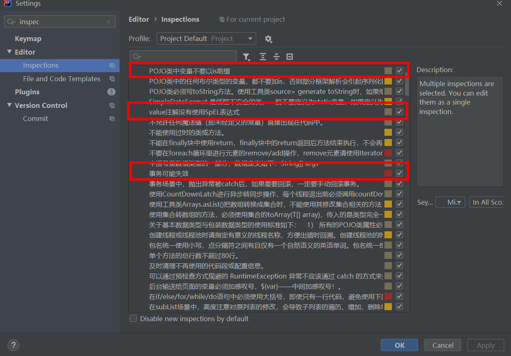
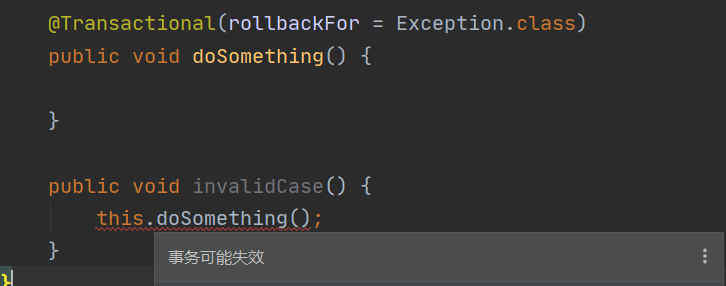
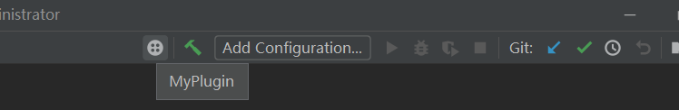
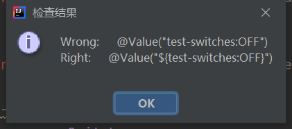

## 个人介绍


#### 一、教育经历


```
西电电子科技大学计算机技术		
硕士学位		2016~2019

西安电子科技大学计算机科学与技术  
学士学位		2012~2016	
```


在校期间勤勤恳恳，受老师同学喜爱。通过CET6，荣获院三好学生、优秀学生干部、优秀研究生等奖项。


#### 二、工作经历


```
毕业后先工作与浙江仟和网络科技有限公司（即点我达）调度部门，工作于调度部门，
负责日常调度系统业务开发与维护、问题查询及相关生态建设。

2020年初公司被阿里菜鸟BU收购，融入菜鸟体系后工作于订单平台，
负责实操层面订单相关业务的系统开发与维护、线上问题查询及系统迁移与融合。一直至今。
```


工作期间兢兢业业，按时优质完成业务需求，注重代码质量与规范，熟悉公司业务发展与规划，有一定自己的见解，善于沟通交流，对业务需求的解决方式提出自己的建议。能够独立解决问题，并推动上下游，负责整个链路进展。


#### 三、联系方式

​	邮箱：495162720@qq.com


----


## 个人项目


工作学习中，自己独立开发的一些项目和玩具


#### 一、钉钉消息分组发送服务


[钉钉消息分组发送服务](https://github.com/yaogeass123/dispatch-sender-service)


背景：

对于线上服务出现了故障或错误应该有实时的反馈途径，目前反馈到钉钉群中，存在以下问题。

1. 钉钉消息机器人目前一分钟只能发送20条消息，超过该限制时，会被限流十分钟。使用机器人发送消息时，若一时间推给机器人发送消息的请求过多（每分钟超过二十条），会导致超过数量的消息发不出去，并且机器人被限流。
2. 当前消息发送时需要指定一个机器人，而一个群最多可以指定6个机器人。
3. 目前所有的异常都集中在群中进行警报，网络抖动时产生的大量异常堆栈有时会淹没需要关注的错误异常。
4. 很多想要通过钉钉发送的消息通过error日志的形式进行警报。
5. 大量警报按部门报警，较为杂乱，无配置规则。


方法：

做一个钉钉群消息发送平台，对外提供接口，外部通过调用接口发送钉钉消息。

通过使用该系统进行发送，解决的问题：

1. 消息聚合：某一时间段内，重复消息只发送一次。
2. 机器人一定不被限流：避免一分钟内某个机器人发送消息过多导致被限流的场景
3. 消息的自动分流：通过配置，可以将同一应用不同消息发送到不同的群中，也可以将不同应用的消息发送到同一群中。消息选择群的规则可配置。
4. 消息的正常情况下的及时触达：保证消息一定会在对应的群中进行报警。
5. 重要消息在大流量请求下的优先发送：某一群同时有大量消息待发送时，对消息进行优先级排序，优先发送重要消息。
6. 消息发送失败有相应的异常处理与反馈逻辑：消息发送失败时，进行对应的逻辑判断，对于部分失败原因进行反馈与处理。


#### 二、Alibaba Coding Guidelines增强套件


[Alibaba Coding Guidelines增强套件](https://github.com/yaogeass123/p3c-pmd-ex)是魔改Alibaba Java Coding Guidelineslines的增强插件，实现了自定义的九条规则规范，实时显示。


目的：在开发过程中及时发现代码的规范问题与潜在的错误。

1. 同一manager中非事务函数调用事务函数，导致事务失效。

2. 使用乐观更新。

3. POJO 类中布尔类型的变量，都不要加 is 前缀，否则部分框架解析会引起序列化错误。

4. 枚举类名带上 En 后缀，枚举成员名称需要全大写，单词间用下划线隔开。 


5. catch中打印异常信息不允许使用info。

6. @Value注解使用SpEL表达式。

7. 对 trace/debug/info 级别的日志输出，必须使用条件输出形式或者使用占位符的方式。

8. 可以通过预检查方式规避的 RuntimeException 异常不应该通过 catch 的方式来处理。

9. 异常信息应该包括两类信息：案发现场信息和异常堆栈信息。不要把堆栈信息吃掉
   


效果：




提示样例：

   


#### 三、SpEL表达式检测IDEA插件


[SpEL表达式检测IDEA插件](https://github.com/yaogeass123/myPlugin)检测项目内所有@Value注解的内容，使用正则表达式进行匹配，看是否使用了正确的SpEL表达式并且有默认值。为什么写这个小工具呢，因为有一次发现SpEL表达式写错后修改时有漏改情况。

安装好插件后toolbar会新加一个按钮，点击执行。

效果：






#### 四、SpEL表达式检测Maven插件

[SpEL表达式检测Maven插件](https://github.com/yaogeass123/maven-check-plugin)目的与原理同上，只不过写程maven插件，在项目打包时进行检测，如果存在错误则使打包失败。


#### 五、C2MSVL语言转换工具


研究生毕业设计项目，实现一个语言的自动转换系统，通过词语法分析、语义分析和转换等过程将C语言自动的转换成等价的MSVL语言。通过对MSVL程序进行建模仿真运算，从而间接地找出源C程序的性质，验证其正确性。


论文地址：
1.毕业设计论文： [《C-to-MSVL转换系统关键技术研究》](https://kns.cnki.net/KCMS/detail/detail.aspx?dbcode=CMFD&dbname=CMFD202001&filename=1020003780.nh&v=MDg4MTlNVkYyNUhyTzRIZGJFcjVFYlBJUjhlWDFMdXhZUzdEaDFUM3FUcldNMUZyQ1VSN3FmWU9Sb0Z5N25Xci8=)
2.外文期刊，Theoretical Computer Science，第五作者： [《Translating Xd-C programs to MSVL programs》](https://kns.cnki.net/KCMS/detail/detail.aspx?dbcode=SJPD&dbname=SJPDLAST&filename=SJPDD889ECD596A964C98269DBC6288FCA1C&v=Mjg3MjMrQlhvOXZCOGI2RGwwUEEyUnFoQTljY1RuTkx2c0NKVWFGMXVRVXIvUEpsY1NibUtDR1lDR1FsZkJyTFV5NU41aHdyMit4S2c9TmlmYmFzZXdGdGk1M1B0QWJlMQ==)


最后附一张当年帅帅的生活照~

